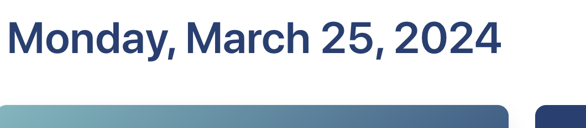

# **Interactive Front-End Project: Daily Task List with Weather & News Updates**

# Purpose:
The purpose of this project was to work in a group setting, and take everything we've learned in class over the past six weeks to create a real-world front-end application for our portfolios.

# Proposal:
Here is a link to our project proposal: https://docs.google.com/document/d/1Nmnr4t2qOZ9Cw_5P_Igc0qXeRajCBWISYu6bSHtewF8/edit

# Description: 
Our purpose of this project was to create a webpage that uses interactive daily tasks in conjunction with the weather and news updates accordingly.

# Our user story: 
As a user,
I want to see the upcoming weather and current news 
so that I can create a personalized, relevant and informational task list for the day

We began by doing research and finding sources -- these videos were equally helpful in various parts of the assignment.

# Sources:
https://bulma.io/documentation/columns/sizes/, https://www.youtube.com/watch?v=IiPQYQT2-wg&amp;ab_channel=TraversyMedia, https://weatherwidget.io/, https://www.youtube.com/watch?v=XH5OW46yO8I&ab_channel=FlorinPop, https://openweathermap.org/api, https://newsdata.io/blog/how-do-q-qintitle-qinmeta-works/ 

As a group, we followed the resources to create the Javascript, HTML, and CSS. Here are some screenshots of how our thought process worked. 

# Here were the responsibilities broken down:

- David: Task list, HTML organization
- Storm: Weather section and API + fixed merge conflicts
- Zoe: News section and API, syntax, presentation
- Stephanie: Styling, modal pop up and Bulma integration, readme

First, we grabbed colors I liked more than Bulma's, and messed around with them for the weather palette. These were adjusted slightly as we went along to make something sharp, but still kept the colors in a teal-palette our group liked.

Here was our basic wireframe that we rolled with and generally stuck to during our working process:

Here's a little screenshot of our working process with the task list as we built the page:

Here's more of our working process:

Here, you can see how we incorporated the Bulma styling:

Here's a screenshot of our final deployed app in process, where you can search the city weather, add to your task list that saves to local storage, and search for trendy topics:

Here, you can interact with the pop up modal where you can clear the list out, or keep it as-is:

Additionally, our page uses Bulma styling for responsiveness and friendly user interaction on mobile devices:

One cool feature we included was the day of the week, month, date, and year that updates daily accordingly and really ties our project together:

# In the future, we'd like to add things like:
- add a checklist feature in addition to be able to remove items (ie -- mark as complete)
- be able to rearrange list items
- allow for weekly planning, rather than just daily
    - allows users to move items between days, planning based on weather and news
- planning for specific times of the day
- include a notetaking feature
- allows users to bookmark or save news links within the app
- include a night mode on the weather icons

# Group Challenges:
- working with GitHub in a collaborative environment
    - coordinating to ensure everyone is working in the same stage of production
        - doing frequent commits and pulls
        - resolving merge conflicts!!! (this was a big one)
- integrating bulma to parts of the project it was not used previously

# Group Successes:
- the aforementioned collaboration and communication. Everyone always knew where the rest of the team was at and what was in-process
- the group's ability to problem-solve as a whole as well as maintaining positivity throughout the project while resolving conflicts (primarily -- merge conflicts)
- ultimately, we are very proud of the product we developed and how we used our different skills and interests to work together in a successfully efficient and collaborative environment

# In conclusion:
Our group built a page that meets all of the project requirements where the the page:
- uses CSS framework other than Bootstrap (see: Bulma styling)
- is deployed to GitHub
- is interactive and uses 2 server-size API's
- has one pop up modal and client-side storage to store data
- is responsive with a polished UI
- has a clean repository

Please follow this link to our fully deployed project on GitHub, and enjoy looking through the work our collective team effort produced:

https://davidbeane1983.github.io/Project1/